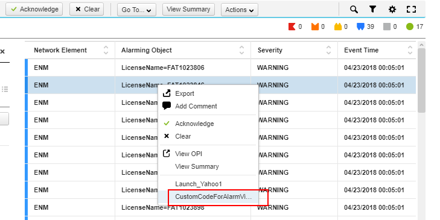
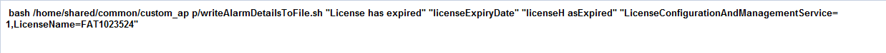
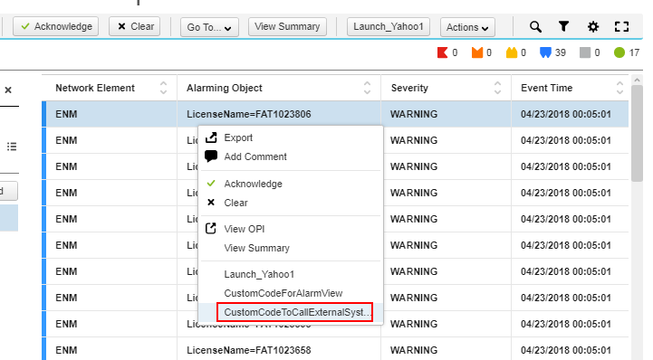
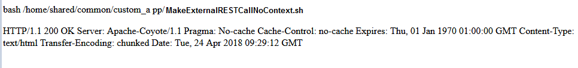

# Examples for Triggering an Executable #

### Example 1: Use alarm information from a single alarm, return success indication. ###

This example presents a new UI action to Alarm Monitor which is applicable for all alarms. On selection it will run /home/shared/common/custom_app/writeAlarmDetailsToFile.sh script by passing the alarm properties like specificProblem, eventType, probableCause, objectOfReference and writes alarm details to a file(AlarmInfo.txt)

1.update customAppConfig.json file as below

```
"executableDetail": [
{
"guiLabel": "CustomCodeForAlarmView",
"commandToExecute": "bash /home/shared/common/custom_app/writeAlarmDetailsToFile.sh",
"context": "\"%specificProblem%\" \"%eventType%\" \"%probableCause%\" \"%objectOfReference%\"",
"actionEnable": "true",
"customAction": "true",
"actionRule": {
"condition": {
"dataType": "ManagedObject"
}
}
}
],
```

2.Customization Installer has to copy or ftp the script to /home/shared/common/custom_app and give 755 or 750 permissions to the script

```
[root@svc-2-scripting(enmapache) common]$ cd custom_app/
[root@svc-2-scripting(enmapache) custom_app]$ pwd
/home/shared/common/custom_app
[root@svc-2-scripting(enmapache) custom_app]$ ls -ltr
total 1
-rwxr-xr-x. 1 root root 1 Apr 23 06:52 writeAlarmDetailsToFile.sh
[root@svc-2-scripting(enmapache) custom_app]$ chmod 755 writeAlarmDetailsToFile.sh
```

3.Run custom_app_integration.sh by following the steps in Adding of Custom Actions to ENM Application

4.Open the Alarm Viewer application from ENM Launcher

* Select any alarm and Click CustomCodeForAlarmView.

<a href="images/alaramview.png" target="_new"></a> 

Output will be displayed in  a new tab which shows the alarm details of selected alarm

<a href="images/alaramoutput.png" target="_new"></a>

5.In this example the output of the script will be written to AlarmInfo.txt

**Output:**

```
[root@svc-2-scripting(enmapache) custom_app]$ cat /ericsson/custom/AlarmInfo.txt
Alarm Details are:
"License is nearing its expiry date"
"licenseExpiryThreshold"
"thresholdCrossed"
"LicenseConfigurationAndManagementService=1,LicenseName=FAT1023846"
```

```
In this example below configured context of Alarm Details will be written to the file
specificProblem
eventType
probableCause
objectOfReference
```

### Example 2: Successfully make a call to an external system and return a value e.g. REST call to get the current time for a locale, or to get a stock quote ###

```
Connecting to esmon vm is taken as an example to connect to an external system using REST call. The output of the REST call for this example is given below.
```

1.Update customAppConfig.json file to mention the script details

```
"executableDetail": [
{
"guiLabel": "CustomCodeToCallExternalSystem",
"commandToExecute": "bash /home/shared/common/custom_app/MakeExternalRESTCallNoContext.sh",
"context": "",
"actionEnable": "true",
"customAction": "true",
"actionRule": {
"condition": {
"dataType": "ManagedObject"
}
}
}
],
```

2.Customization Installer has to copy or ftp the script to the below path. A sample script is given as example

```
[root@svc-2-scripting(enmapache) custom_app]$ pwd
/home/shared/common/custom_app
[root@svc-2-scripting(enmapache) custom_app]$ ls -ltr
total 2
-rwxr-xr-x. 1 root root 140 Apr 23 07:10 AlarmDetails.sh
-rwxr-xr-x. 1 root root  82 Apr 23 07:52 MakeExternalRESTCallNoContext.sh
```
Sample Script:

```
[root@svc-2-scripting(enmapache) custom_app]$ cat MakeExternalRESTCallNoContext.sh
\#!/bin/sh
/usr/bin/curl -I -u esmadmin:ericssonadmin esmon:7080/rest/status.html;
[root@svc-2-scripting(enmapache) custom_app]$
```

3.Execute custom_app_integration.sh by following the steps in [Adding of Custom Actions to ENM Application](use-case-add-action-link.html)

4.Open the Alarm Viewer application from ENM Launcher

* Select any alarm and Click CustomCodeToCallExternalSystem.

<a href="images/alaramcallext.png" target="_new"></a>

A new tab will be opened which shows the output of the script

<a href="images/alaramcallextoutput.png" target="_new"></a>